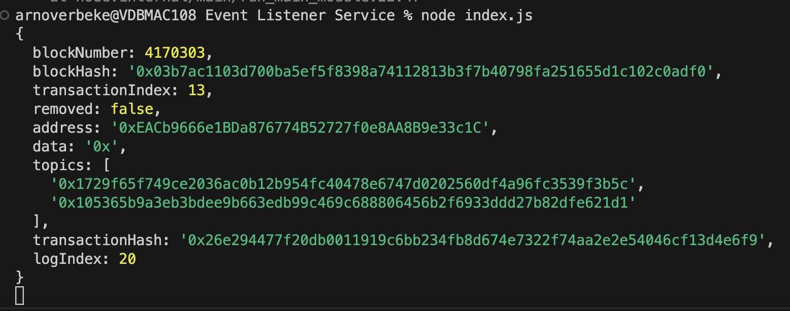

# Setup Event Listener Service

- `npm install alchemy-sdk`
- Fill in the alchemy api key (avaliable through their website)
- Fill in yout smart contract address off the contract you want to listen to
- Fill in the signature of the event to listen to
  - Easy to find on etherscan by filling in the contract address and clicking the events tab
  * In the overview of the events tab the different topics of the events will be shown. Topic0 is the event signature the other topics the the indexed parameters.

* run the js file: `node index.js`

The result should look something like this 
